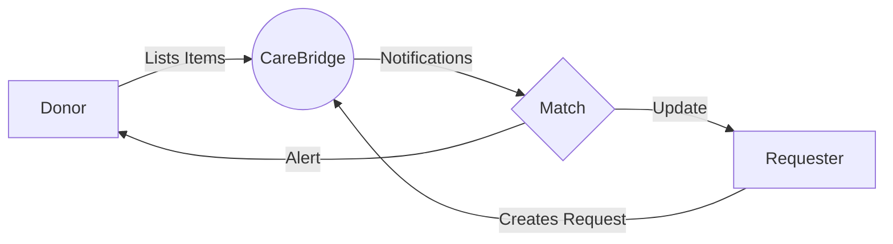

<div align="center">

# 🌟 CareBridge
### *Connecting Compassion with Need* 

[](https://github.com/Hirumitha-Kuladewa/CareBridge-Android-Java)
[](https://developer.android.com)
[](https://firebase.google.com)
[](https://www.java.com)

[Features](#key-features) • [Tech Stack](#tech-stack) • [Installation](#installation) • [Contributing](#contributing)

</div>

---

## 📱 About
CareBridge is a revolutionary Android application that bridges the gap between donors and those in need. Built with Java and powered by Firebase, it creates a seamless platform for managing urgent donations and requests for essential items in real-time.

<div align="center">



</div>

## ✨ Key Features

### 🔐 User Authentication
- **Secure Login System**
  - Firebase Authentication integration
  - Email/Password authentication
  - Social media login options
  - Password recovery system

### 📝 Smart Forms

#### 🎁 Donor Form
- Item categorization
- Condition assessment
- Quantity specification
- Location tagging
- Photo upload capability

#### 📋 Requester Form
- Priority level selection
- Detailed item description
- Preferred collection method
- Urgency indicator
- Location preferences

### 📊 Interactive Analytics

<div align="center">

| Metric | Visualization |
|--------|---------------|
| Donation Types | Animated Pie Chart |
| Request Frequency | Timeline Graph |
| Match Rate | Progress Bars |
| Response Time | Heat Map |

</div>

### 🔔 Smart Notifications
- **Real-time Updates**
  - Instant matching alerts
  - Request status changes
  - New donation notifications
  - Priority request broadcasts

### 📱 User Interface Highlights
- Material Design 3.0
- Dark/Light theme support
- Smooth animations
- Intuitive navigation
- Accessible design

## 🛠️ Tech Stack

<div align="center">

| Category | Technology |
|----------|------------|
| 📱 Frontend | Java + XML |
| 🔧 IDE | Android Studio |
| ☁️ Backend | Firebase Suite |
| 📊 Analytics | MPAndroidChart |
| 🎨 UI/UX | Material Design |

</div>

## 🚀 Installation

```bash
# Clone the repository
git clone https://github.com/Hirumitha-Kuladewa/CareBridge-Android-Java.git

# Navigate to project directory
cd carebridge

# Open in Android Studio
./gradlew build
```

## 🤝 Contributing

We welcome contributions! Please follow these steps:

1. Fork the repository
2. Create a feature branch
3. Commit your changes
4. Push to the branch
5. Open a Pull Request

## 📫 Contact

For support or queries, reach out to:
- Email: hirumithakuladewanew@gmail.com

---

<div align="center">

Made with ❤️ by the CareBridge Team

</div>
